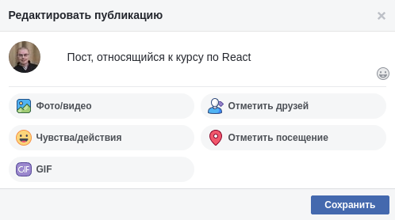

CRUD
===

Вам необходимо реализовать CRUD при работе с HTTP с использование Router'а.

Backend вы можете либо написать сами, либо взять готовый (из каталога `backend`).

Вы используете только id, content и created, в качестве остальных значений (имя, фото) можете поставить заглушки.

## Общая механика

При нахождении на странице `/` отображается список существующих постов (GET на адрес http://localhost:7777/posts), полученные данные отображаются в виде карточек:

Кнопка "Создать пост" ведёт на страницу добавления (см. ниже) `/posts/new`.

При клике на саму карточку происходит переход на страницу просмотра поста (см. ниже) `/posts/:postId`.

### Страница создания

На странице создания `/posts/new` отображается карточка создания:

При нажатии на кнопку "Опубликовать", пост сохраняется (POST на адрес http://localhost:7777/posts body: `{"id": 0, "content": "То, что введено в поле ввода"}`), после чего осуществляется редирект на главную страницу.

При нажатии на крестик (в верхнем правом углу) происходит редирект на главную без сохранения (advanced: можете сохранить в localStorage и потом вытаскивать оттуда).

### Страница просмотра

На странице просмотра `/posts/{id}` отображается краточка просмотра:

При клике на кнопку "Удалить" происходит удаление поста (DELETE на адрес http://localhost:7777/posts/{id}), после чего осуществляется редирект на главную страницу.

При клике на кнопку "Редактировать" карточка просмотра заменяется карточкой редактирования:

На карточке редактирования:
* кнопка сохранить приводит к сохранению поста (POST на адрес http://localhost:7777/posts body: `{"id": не 0, "content": "То, что введено в поле ввода"}`) и  отображению карточки просмотра (с обновлёнными данными).
* кнопка крестик приводит к возврату к карточки просмотра.